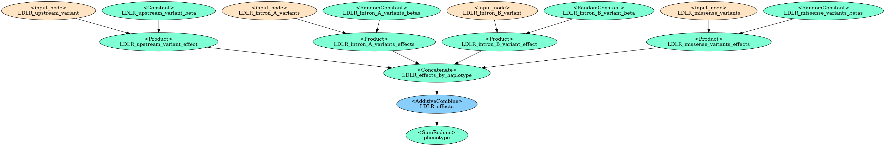

# CITRUS User Guide

CITRUS, the CIs and Trans inteRaction nUmerical Simulator, is a tool for simulating phenotypes with complex genetic archetectures that go beyond simple models that assume linear, additive contributions of individual SNPs. The goal of this tool is to provide better simulations for benchmarking GWAS/PRS models.

In CITRUS, simulations are defined by a directed tree-like graph. The directed graph is composed of input nodes, representing genetic variants, and operator nodes, which represent intermediate operations and their resulting values. The edges represent the flow of values from the input nodes to the final operator node, whose resulting value represents the phenotype being simulated.

This flexible framework allows users to design or generate simulations of phenotypes with more complex dynamics and interactions than previous tools. These include:

* Cis- and Trans-acting interactions
* Haplotype-based interactions and dominance/recessiveness/additivity models
* Conditional operations
* Sampling from distributions in place of fixed values
* And more!

In additional to simulating phenotypes, CITRUS allows for calculation of [SHAP](https://shap.readthedocs.io/en/latest/) Shapley values, which estimate the contribution of each variant to the phenotype. This allows for the generation of a ground truth for testing the ability of downstream models to detect relevant variants. 

This guide walks through how CITRUS simulations work, how to define and run them, and how to compute their SHAP values.



## Table of Contents

* [CITRUS Simulation Mechanics](#citrus-simulation-mechanics)
	* [Values in Simulations](#values-in-simulations)
	* [Input Nodes](#input-nodes)
	* [Operator Nodes](#operator-nodes)
* [Defining Simulations](#defining-simulations)
	* [Input Configuration](#input)
		* [Defining Input Sources](#defining-input-sources)
		* [Defining Input Nodes](#defining-input-nodes)
	* [Simulation Steps Configuration](#simulation-steps)


# CITRUS Simulation Mechanics

CITRUS simulations are defined by a directed graph with two types of nodes: input nodes and operator nodes. The directed graph models the flow of values from the input nodes, which read values from a data file, through operator nodes, which apply some function to the values. Together these define a numerical simulation of a phenotype based on genotype data.

## Values in Simulations

All nodes return either a single `n x m` matix or two `n x m` matrices if the values are at the haplotype level (e.g. one per haploid genotype for the input nodes). The `m` dimension is the number of samples being simulated and `n` is the number of values being output for each person or haplotype of a person by that node.

These values are either passed to other operator nodes which apply some function to them to produce a new set of values or, for the final sink node, the resulting values are the simulated phenotype values.

## Input Nodes

Input nodes read phased genetic data from VCF-like files. They return a tuple of two `n x m` matrices, one per haploid genotype. The order of the matrices in the tuple is the same as the order of the haploid genotypes in the input file. 

Input nodes typically represent reference and alternate alleles as 0 and 1, respectively, but may have other behavior (TODO) for multi-allelic sites or other features like SNP copy number. An example of output from two input nodes with six samples is below, where the first is a node with a single SNP value per person and the second is a node with two SNPs per person.

```python
# Values returned by single SNP input node
(array([0, 1, 1, 0, 0, 0]), array([1, 1, 0, 1, 1, 0]))

# Values returned by two SNP input node
(array([[1, 0, 1, 1, 1, 0],
        [1, 0, 0, 1, 1, 1]]),
 array([[1, 0, 1, 1, 1, 0],
        [1, 1, 1, 0, 1, 1]]))
```

## Operator Nodes

Operator nodes take as input the output from one or more nodes and apply some function to them to produce a new set of values. These nodes can be used to model things like weights, interactions, dominance relationships, and noise. Operator nodes fall into two classes based on how they handle input haplotype-level tuples of values.

Descriptions of available operators and links to the full documentation are [here](operator_nodes.md).

### Haplotype Combine Operators

Haplotype combine operators are used to model interactions between haplotypes to combine them into a single person-level matrix. These operators model things like dominance, recessiveness, and additivity. They take as input only haplotype-level tuples of values and apply some function to the to produce a single `n x m` matrix of values. An example of the output from an AdditiveCombine haplotype combine operator is below.

```python
# Input values
(array([[ 0. ,  0. ,  1. ,  1. ,  0. ],
        [ 0.2,  0.3,  0.4,  0.5, -0.6]]),
 array([[ 1. ,  0. ,  1. ,  0. ,  0. ],
        [-0.2,  0.3, -0.3,  0.2,  0. ]]))

# Output values from AdditiveCombine
array([[ 1. ,  0. ,  2. ,  1. ,  0. ],
       [ 0. ,  0.6,  0.1,  0.7, -0.6]])
```

### General Operators

If any input values to general operators are haplotype-level, the operator will apply the function to each haplotype separately and return a tuple of two `n x m` matrices. The order of the matrices in the tuple is preserved. When there is a mix of person-level and haplotype-level values, the person-level values are applied to each haplotype seperately. When the input is all person-level values the output will be a single `n x m` matrix.

A pseudocode example with the SumNode is below. It shows the operators ability to work with both haplotype-level and person-level values. See the [SumNode documentation](operator_nodes/math_func.md#class-sum) for more details.

```python
# Input values
person_level_single_val = array([1, 2, 3, 4, 5])
person_level_two_vals = array([[1, 1, 1, 1, 1],
                               [2, 2, 2, 2, 2]])
haplotype_level = (
	array([[-1, -1, -1, -1, -1],
	       [-1, -1, -1, -1, -1]]),
	array([[-2, -2, -2, -2, -2],
	       [-2, -2, -2, -2, -2]])
)

# Node output
SumNode(person_level_single_val, person_level_single_val)
>>> array([2, 4, 6, 8, 10])

SumNode(person_level_single_val, person_level_two_vals)
>>> array([[2, 3, 4, 5, 6],
           [3, 4, 5, 6, 7]])

SumNode(person_level_single_val, haplotype_level)
>>> (array([[0, 1, 2, 3, 4],
            [0, 1, 2, 3, 4]]),
     array([[-1, 0, 1, 2, 3],
            [-1, 0, 1, 2, 3]]))

SumNode(person_level_single_val, person_level_single_val, haplotype_level)
>>> (array([[1, 2, 3, 4, 5],
            [2, 3, 4, 5, 6]]),
     array([[0, 1, 2, 3, 4],
            [1, 2, 3, 4, 5]]))
```


# Defining Simulations

Users define a directed graph of the simulation in a configuration JSON file. Simulation configuration JSON files define a dictionary with keys 'input' and 'simulation_steps'. The 'input' key maps to a list of input sources and their resulting input nodes. The 'simulation_steps' key maps to a list of operator or nodes and their input edges, which defines the rest of the graph. All input nodes and operator nodes have a unique string alias.

For examples and walkthroughs of designing and configuring simulations, see [Designing Simulations](designing_simulations.md).

## Input

CITRUS uses phased genetic data in one of several VCF-like file formats (VCF, TODO BGEN, GEN) as input. The 'input' section of the JSON config file defines a list of input sources represented by dictionaries. Each input source represents a file or multiple files and defines the input nodes whose values are derived from that data. An example input section defining a single input source with two input nodes is below. All input sources must include sample IDs, and phenotypes will only be simulated for samples in all input sources.

```json
{
	"input": [
		{
			"file": "../pheno_sim_demos/1000_genomes_data/genotypes_chr19.vcf.gz",
			"file_format": "vcf",
			"reference_genome": "GRCh37",
			"force_bgz": true,
			"input_nodes": [
				{
					"alias": "LDLR_intron_variant",
					"type": "SNP",
					"chr": "19",
					"pos": 11216561
				},
				{
					"alias": "LDLR_missense_variants",
					"type": "SNP",
					"chr": "19",
					"pos": [11242133, 11222300]
				}
			]
		}
	],
	...
}
```

### Defining Input Sources

Each input source is represented by a dictionary with the following keys:

* file (optional, otherwise provided by command line argument): Path to the data file, list of file paths (if not using CLI), or hadoop glob pattern matching file(s).
* engine (optional str, default "hail"): The engine to use to read the data file. Currently only hail is supported.
* file_format (optional str, default "vcf"): The format of the data file. Currently only VCF is supported.
* input_nodes (optional list of dicts): A list of dictionaries that define the input nodes that use this data source.

#### Engine and File Format Specific Keys

Additional keys are used based on the engine used to load the data and the file format. See the [Input Sources documentation](input_sources.md) for more information.


### Defining Input Nodes

Input nodes are defined in the 'input_nodes' list of dictionaries. Each dictionary defines a single input node, but nodes may contain multiple variants (as with the "LDLR_missense_variants" node in the example above). Like all nodes in the graph, input nodes have a unique string alias that is used to refer to them in the the configuration file (e.g. when specifying the input to operator nodes).

The typical behavior of input nodes is to treat the reference allele as a 0 and any alternate alleles as a 1. Nodes may specify other behavior to handle things like multi-allelic sites or other features like SNP copy number.

All dictionaries defining input nodes must have the following keys:

* alias: The alias for the input node. This is used to refer to the node in the simulation configuration, when plotting, and when computing SHAP values.
* type: The type of the input node. See [Input Node Types](input_nodes.md#input-node-types) for more information. Values in that section's headers in parentheses are the values for the 'type' key (e.g. "snp" for single nucleotide polymorphism input nodes).

They may also have additional arguments specific to the input node type (e.g. to specify a locus). For more information, see the [Input Nodes documentation](input_nodes.md#input-node-types).


## Simulation Steps

The 'simulation_steps' section of the JSON config file is a list that defines the rest of the graph: the operator nodes and their in-edges. Each operator node is represented by a dictionary that must have the keys:

* alias: The alias for the operator node. This is used to refer to the node in the simulation configuration and when plotting.
* type: The type of the operator node. See TODO [Operator Node documentation](operator_nodes.md) for more information. Values for the 'type' key are class names of the operator nodes (e.g. "SumNode" for the SumNode operator node).

Operator nodes will have additional keys specific to the operator node type. These additional keys will be the the the operator's `__init__` function. See the [Operator Nodes documentation](operator_nodes.md) for more information and links to the full documentation.

At least one of these class specific arguments will define what other nodes are inputs to the operator node. This is done using the string aliases of any input nodes. Only nodes that are defined **before** a given operator node in the configuration file may be inputs. For example, the fourth operator node defined in 'simulation_steps' list may have as input any of the input nodes and the first three operator nodes, but not the fifth operator node in the list.

The following example would work with the 'input' in the [Input Configuration](#input) example above. This implements a linear additive model.

```json
{
	...,
	"simulation_steps": [
		{
			"type": "Constant",
			"alias": "LDLR_intron_variant_beta",
			"input_match_size": "LDLR_upstream_variant",
			"constant": 0.1
		},
		{
			"type": "RandomConstant",
			"alias": "LDLR_missense_variants_betas",
			"input_match_size": "LDLR_missense_variants",
			"dist_name": "normal",
			"dist_kwargs": {
				"loc": 0.25,
				"scale": 0.2
			},
			"by_feat": true
		},
		{
			"type": "Product",
			"alias": "LDLR_intron_variant_effect",
			"input_aliases": [
				"LDLR_intron_variant_beta", "LDLR_intron_variant"
			]
		},
		{
			"type": "Product",
			"alias": "LDLR_missense_variants_effects",
			"input_aliases": [
				"LDLR_missense_variants_betas", "LDLR_missense_variants"
			]
		},
		{
			"type": "Concatenate",
			"alias": "LDLR_effects_by_haplotype",
			"input_aliases": [
				"LDLR_intron_variant_effect",
				"LDLR_missense_variants_effects"
			]
		},
		{
			"type": "AdditiveCombine",
			"alias": "LDLR_effects",
			"input_alias": "LDLR_effects_by_haplotype"
		},
		{
			"type": "SumReduce",
			"alias": "phenotype",
			"input_alias": "LDLR_effects"
		}
	]
}
```

# Running Simulations

Simulations can be run either with the [command line interface](cli.md) or the Python API. To run a simulation with the CLI, use the following command if the 'file' key is specified for each input source in the configuration file:

```bash
citrus simulate -c <config_json_file>
```

This will output a CSV file with the simulated phenotypes and all intermediate simulation values and a JSON file with the simulation configuration updated with any random values drawn as variables in the simulation (for reproducibility and SHAP).

# Running SHAP

SHAP values are Shapley value estimates that say for each sample how much each input genotype impacted the phenotype. They can be used to establish some ground truth on how input variants impact a phenotype that can later be used to evaluate the performance of other methods designed to identify causal variants.

TODO: Add SHAP documentation
